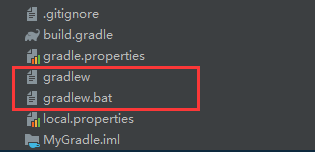

# Gradle生命周期

在一个Android工程中可能有很多个Module,那么每一个Module都会对应着一个Project对象

在gradle中，project就好像是android中的activity一样，经常使用，所以project概述是一个很重要的概念

在android工程中，所有的lib,module都是一个project


Gradle生命周期分为三个部分，如下：

1 初始化阶段: 解析整个工程中所有Project,构建所有的Project对应的project对象，这个阶段主要就是解析setting.gradle文件

2 配置阶段：解析所有的projects对象中的task，构建好所有的task拓扑图，主要解析各个project下的build.gradle文件

3 执行阶段：执行具体的的task及其依赖task

# Gradle的生命周期的监听

在root build.gradle中，添加如下代码：
``` 
/**
 * 配置阶段开始前回调监听
 */
this.beforeEvaluate {
}
 
/**
 * 配置阶段完成后回调监听
 */
this.afterEvaluate {
    println '配置阶段完成...'
}
 
/**
 * gradle执行完毕的回调监听
 */
this.gradle.buildFinished {
    println 'gradle执行完毕...'
}

this.gradle.addBuildListener(new BuildListener() {
    @Override
    void buildStarted(Gradle gradle) {
 
    }
 
    @Override
    void settingsEvaluated(Settings settings) {
 
    }
 
    @Override
    void projectsLoaded(Gradle gradle) {
 
    }
 
    @Override
    void projectsEvaluated(Gradle gradle) {
 
    }
 
    @Override
    void buildFinished(BuildResult result) {
 
    }
})
```


# Gradle 的插件可以有三种形式来提供：

> Build script（.gradle中定义）

直接在build.gradle中编写Plugin，这种方式这种方法写的Plugin无法被其他 build.gradle 文件引用。

> buildSrc project（module中定义）

单独的一个Module，这个Module的名称必须为buildSrc，同一个工程中所有的构建文件够可以引用这个插件，但是不能被其他工程引用。

> Standalone project（module中定义）

在一个项目中自定义插件，然后上传到远端maven库等，其他工程通过添加依赖，引用这个插件。
在buildSrc中创建自定义Gradle插件只能在当前项目中使用，因此，对于具有普遍性的插件来说，
通常是建立一个独立的Module来创建自定义Gradle插件。

区别在于：

不需要把 module 的名称的写死，也就是你可以随意的命名，buildSrc会自动的编译和加入到classpath中，这里我们需要手动依赖，需要上传到maven仓库中


1、在当前工程下创建一个 Java Library 的 module，起名字为 buildSrc（别的名字需要maven打包）

2、
将Module里面的内容删除，只保留build.gradle文件和src/main目录。
将 src/main/java 修改为 src/main/groovy ，在groovy包下新建包名，如：com.xq.groovy ，
然后在该包下新建groovy文件，通过new->file-> MyCustomPlugin.groovy来新建名为 MyCustomPlugin 的groovy类文件。
创建的类 MyCustomPlugin 实现 Plugin 接口并覆写 apply(T garget) 接口

Plugin<T> 是一个泛型接口，在定义插件是应该将这个泛型填为 Project 即可。

3、src/main下新建resource文件夹，然后在resources目录里面再新建META-INF目录，
再在META-INF里面新建gradle-plugins目录。最后在gradle-plugins目录里面新建properties文件，
可以自定义，如com.xq.groovy.properties，apply plugin时要用到。
```
# 自定义的gradle plugin的类
implementation-class=com.xq.groovy.MyCustomPlugin
```

4、在外部应用这个插件

//在 app 下的 build.gradle 引用这个插件,
//resources/META-INF/gradle-plugins下的【properties文件名称】
apply plugin: 'com.xq.groovy'

# 打包到本地Maven

如果是自定义名字的module，我们可以本地打包，

```  
apply plugin: 'groovy'
//打包到本地Maven
apply plugin: 'maven'

//打包到本地Maven
repositories {
    mavenCentral()
}

dependencies {
    //gradle sdk
    compile gradleApi()
    //groovy sdk
    compile localGroovy()
}
repositories {
    jcenter()
}

//打包到本地Maven：设置maven deploy
uploadArchives {
    repositories {
        mavenDeployer {
            //设置插件的GAV参数
            pom.groupId = 'com.xq.plugin'
            pom.artifactId = 'test'
            pom.version = '1.0.0'
            //文件发布到下面目录
            repository(url: uri('../repo'))
        }
    }
}
```
然后执行打包命令：

双击或者 gradlew uploadArchives


# 引用plugin

``` 
 buildscript {
     repositories {
         maven {//本地Maven仓库地址
             url uri('../repo')
         }
     }
     dependencies {
         //maven本地打包定义的gmv,引用格式为-->group:module:version
         classpath 'com.xq.plugin:test:1.0.0'
     }
 }
 
 //自定义gradle plugin的properties文件名
 apply plugin: 'com.xq.groovy'
```

# 测试

app -> other -> myTask(自定义的task)，点击执行，可看到日志。

```  
gradlew :app:myTask
```

# 扩展插件 Extension
  
扩展插件 Extension 就是用于 Plugin 与 Project 通讯用的。

Extension其实可以理解成Java中的Java bean，它的作用也是类似的，即获取输入数据，然后在插件中使用。

定义Extension
``` 
class TestExtension {
    String message
}
```
引用
``` 
class MyCustomPlugin implements Plugin<Project> {
    void apply(Project project) {
        //TestExtension extension = project.getExtensions().create("testExt", TestExtension)
        //1.添加插件扩展到project.extensions集合中
        project.extensions.add("testExt", TestExtension)

        project.task('myTask') << {
            //2.获取外界配置的 TestExtension
            TestExtension extension = project.testExt
            //3.输出插件扩展属性
            println "========================"
            println extension.message
            println "========================"
        }
    }
}
```
赋值 ：

app的build.gradle:
``` 
testExt {
    //给插件扩展的属性赋值
    message  "helloworld"
}
```
验证：

``` 
gradle :app:myTask
```

参考：https://www.jianshu.com/p/ffd6153ace1d


#  gradle 命令



``` 
gradlew：Linux下可执行脚本
gradlew.bat：Windows下可执行脚本
```
 

参考： https://www.jianshu.com/p/a03f4f6ae31d

gradle 任务查询命令


``` 
# 查看任务
gradlew tasks
# 查看所有任务 包括缓存任务等
gradlew tasks --all
# 对某个module [moduleName] 的某个任务[TaskName] 运行
gradlew :moduleName:taskName
```

快速构建命令

```
# 查看构建版本
gradlew -v
# 清除build文件夹
gradlew clean
# 检查依赖并编译打包
gradlew build
# 编译并安装debug包
gradlew installDebug
# 编译并打印日志
gradlew build --info
# 译并输出性能报告，性能报告一般在 
# 构建工程根目录 build/reports/profile
gradlew build --profile
# 调试模式构建并打印堆栈日志
gradlew build --info --debug --stacktrace
# 强制更新最新依赖，清除构建并构建
gradlew clean build --refresh-dependencies
```

gradle 指定构建目标命令

``` 
# 编译并打Debug包
gradlew assembleDebug
# 这个是简写 assembleDebug
gradlew aD
# 编译并打Release的包
gradlew assembleRelease
# 这个是简写 assembleRelease
gradlew aR
```

gradle 构建并安装调试命令

``` 
# 编译并打Debug包
gradlew assembleDebug
# 编译app module 并打Debug包
gradlew install app:assembleDebug
# 编译并打Release的包
gradlew assembleRelease
#  Release模式打包并安装
gradlew installRelease
# 卸载Release模式包
gradlew uninstallRelease
```
gradle 多渠道打包
```  
# Release模式打包并安装
gradlew installRelease
# 卸载Release模式包
gradlew uninstallRelease

# Release模式全部渠道打包
gradlew assembleRelease
# Release模式 test 渠道打包
gradlew assembleTestRelease
# debug release模式全部渠道打包
gradlew assemble
```

gradle 查看包依赖

```  
gradlew 查看包依赖
gradlew dependencies
# 或者模组的 依赖
gradlew app:dependencies
# 检索依赖库
gradlew app:dependencies | grep CompileClasspath
# windows 没有 grep 命令
gradlew app:dependencies | findstr "CompileClasspath"

# 将检索到的依赖分组找到 比如 multiDebugCompileClasspath 就是 multi 渠道分发的开发编译依赖
gradlew app:dependencies --configuration multiDebugCompileClasspath
# 一般编译时的依赖库，不是固定配置方式，建议检索后尝试
gradlew app:dependencies --configuration compile
# 一般运行时的依赖库，不是固定配置方式，建议检索后尝试
gradlew app:dependencies --configuration runtime
```

# 打包上传到蒲公英

Windows需要下载curl并配置环境变量

下载地址为：
https://curl.haxx.se/windows/


查看API Key和User Key ： 
https://www.pgyer.com/account/api


蒲公英使用一条命令快速上传应用：
http://www.pgyer.com/doc/view/upload_one_command


